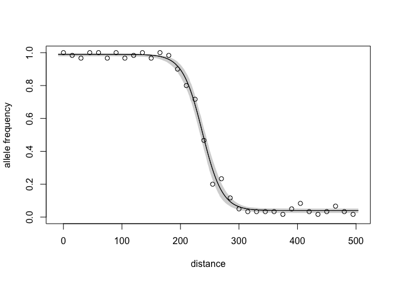
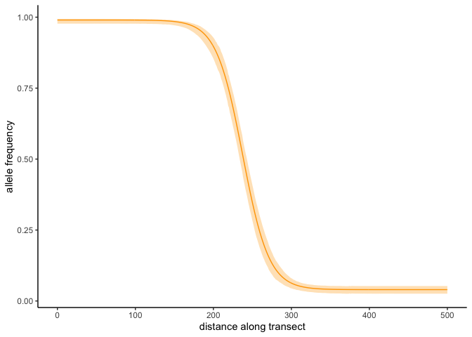

<!-- README.md is generated from README.Rmd. Please edit that file -->
<!-- badges: start -->
[](https://www.tidyverse.org/lifecycle/#experimental)  <!-- badges: end -->

bahz
====

bahz (Bayesian Analysis of Hybrid Zones) is an R package for fitting and analyzing one-dimensional, geographic cline models in hybrd zones.

bahz is currently under active development.

Installation
------------

Before installing bahz, you'll need to install the R package RStan, which interfaces with the Stan modelling language. To install RStan, follow the instructions [here](https://github.com/stan-dev/rstan/wiki/RStan-Getting-Started).

Once Rstan is installed, you can install bahz from Github. If you don't already have it, you'll need to install the R package [devtools](https://cran.r-project.org/web/packages/devtools/index.html):

``` r
install.packages("devtools")
```

Then, you can install bahz:

``` r
devtools::install_github("tjthurman/BAHZ") 
library(bahz)
```

bahz is not currently available from CRAN. If you have any issues installing bahz, please [file an issue on GitHub](https://github.com/tjthurman/BAHZ/issues).

How to use bahz
---------------

Though bahz is still under development, the core model-fitting functionality is operational. Here's a mini-tutorial (with minimal explanation) on how to fit a hybrid zone model with bahz. There is further information in the help files for each function. A more complete tutorial is in the works.

#### Prepare Data

To generate data to analyze, we can simulate genetic data from a one-dimenional genetic cline. bahz provides a function for performing this simulation, which automatically outputs the data in the format needed for downstream analyses. See the the help file at `?prep_geno_data` for information on supported formats.

Here, we will simulate a cline that was sampled across a 500 kilometer transect, with sampling sites every 15 kilometers and 30 individuals sampled at each site. For the cline, we will simulate a decreasing cline, with a cline center at 237 km, a width of 62 km, and minimim and maximum allele frequencies of 0.05 and 0.99, respectively:

``` r
set.seed(123)
data <- sim_geno_cline(transect_distances = seq(0,500,15), n_ind = 30, Fis = 0,
                       decrease = T, center = 237, width = 62, 
                       pmin = 0.05, pmax = .99)
head(data)
#>   site transectDist cline.p cline.f AA Aa aa  N emp.p emp.f
#> 1    1            0    0.99       0 30  0  0 30 1.000     0
#> 2    2           15    0.99       0 29  1  0 30 0.983     0
#> 3    3           30    0.99       0 28  2  0 30 0.967     0
#> 4    4           45    0.99       0 30  0  0 30 1.000     0
#> 5    5           60    0.99       0 30  0  0 30 1.000     0
#> 6    6           75    0.99       0 28  2  0 30 0.967     0
```

#### Specify priors

bahz fits Bayesian models, and thus users need to specify prior distributions for the parameters to be estimated. This is done through a prior configuration file. Users first generate a configuration file with the command:

``` r
make_prior_config()
```

By default this will generate a configuration file template, `prior_config_template.yaml`, in the current working directory. Users can specify other file locations or names. Open the file and edit the priors as you see fit. For this tutorial, you can leave the priors at their default vaules.

#### Fit the model

With our data and priors ready, we can now fit a cline model. For now, we will fit the simplest cline model, using the binomial model of allele frequencies and no introgression tails:

``` r
set.seed(456)
cline.fit <- fit_geno_cline(data = data, prior_file = "prior_config_template.yaml",
                            type = "bi", tails = "none")
```

#### Analyze the results

We can summarize the posterior distribution of the cline parameters:

``` r
cline_summary(cline.fit)
#>    param   mean se_mean   sd low_0.95_HPDI up_0.95_HPDI n_eff Rhat
#> 1 center 237.48    0.04 2.41        232.50       242.03  4272    1
#> 2  width  67.62    0.09 6.01         56.19        79.63  4577    1
#> 3   pmin   0.04    0.00 0.01          0.03         0.05  4575    1
#> 4   pmax   0.99    0.00 0.00          0.98         0.99  5085    1
#> 5    dev 116.04    0.07 2.86        112.21       121.59  1740    1
```

The model has done a good job. The point estimates of the parameters are quite close to the values we specified, and the 95% credible intervals contain the simulated values.

bahz provides some simple plotting functions for visualizating fitted clines:

``` r
plot_geno_cline(stanfit = cline.fit, data = data, add.obs.freqs = T, 
                xlab = "distance", ylab = "allele frequency")
```



For users who wish to make higher-quality, customized plots, bahz has a helper function to calculate predicted allele frequencies from fitted clines. Those data can then be used in the plotting system of the user's choice, e.g.:

``` r
pred_cline <- predict_geno_cline(stanfit = cline.fit, distance = 0:500)
head(pred_cline)
#>   transectDist         p
#> 1            0 0.9899992
#> 2            1 0.9899992
#> 3            2 0.9899992
#> 4            3 0.9899991
#> 5            4 0.9899990
#> 6            5 0.9899990
```

``` r
# Use the ggplot2 package
library(ggplot2)
ggplot(data = pred_cline, aes(x = transectDist, y = p)) +
  geom_line(color = "orange") +
  xlab("distance along transect") +
  ylab("allele frequency") +
  theme_classic()
```



Citation
--------

    #> 
    #> To cite bahz in publications use:
    #> 
    #>   Timothy J Thurman (2019). bahz: Bayesian Analysis of Hybrid
    #>   Zones R package. URL https://github.com/tjthurman/BAHZ
    #> 
    #> A BibTeX entry for LaTeX users is
    #> 
    #>   @Article{,
    #>     title = {{bahz}citation(: Bayesian Analysis of Hybrid Zones},
    #>     author = {Timothy J Thurman},
    #>     journal = {R Package},
    #>     year = {2019},
    #>     url = {https://github.com/tjthurman/BAHZ},
    #>   }

License
-------

bahz is distributed for free under the [GNU Public License v3](https://www.gnu.org/licenses/gpl-3.0.en.html).
